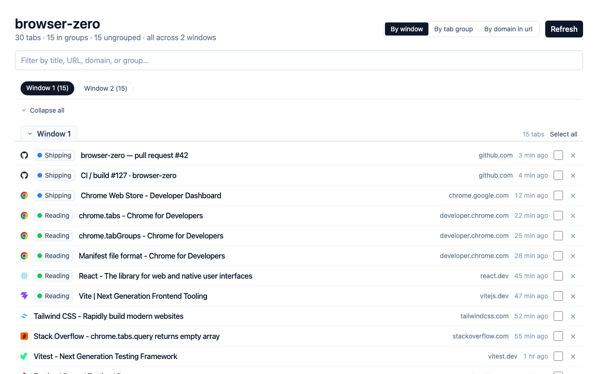

# browser-zero

Every open tab across every Chrome window, on one screen — search, group, drag between windows, bulk close.



## Install

### From the Chrome Web Store

_Listing under review — link coming soon._

### Unpacked (for development or to try a fresh build)

```bash
pnpm install
pnpm build
```

1. Open `chrome://extensions`, enable **Developer mode** (top-right).
2. Click **Load unpacked** and select the `dist/` folder.
3. Click the `browser-zero` toolbar icon — the dashboard tab opens.

## Upgrade

**Web Store version** — Chrome auto-updates it in the background; nothing to do.

**Unpacked version** — Chrome does not auto-update unpacked extensions, so rebuild and reload:

```bash
pnpm build          # or: pnpm build:watch — rebuilds dist/ on every save
```

Then on `chrome://extensions`, click the **↻ reload** icon on the `browser-zero` card to pick up the new bundle.

> `dist/` is gitignored and can disappear between branch switches or `git clean`. If the reload shows _"File path cannot be resolved"_, just run `pnpm build` again to regenerate it.

## Uninstall

- Right-click the `browser-zero` toolbar icon → **Remove from Chrome**, or
- Open `chrome://extensions` → the `browser-zero` card → **Remove**.

Nothing else to clean up — browser-zero is stateless, stores no data, and leaves no residue.

## What it does

- **See everything** — every open tab across every Chrome window in one list, with title, favicon, domain, and how long ago you last touched it.
- **Search instantly** — filter by title, URL, domain, or group name.
- **Group however you think** — by window, by Chrome tab group, or by domain.
- **Jump to any group** — sticky chip nav at the top scrolls to the matching section; chips inherit each group's Chrome color.
- **Collapse what you don't need** — each section header is a clickable Chrome-tab-shaped toggle; the chip nav has an "Expand all / Collapse all" master.
- **Drag tabs between windows** — drag any row to another window section to move it. Drag onto a tab-group section to assign it; drag onto Ungrouped to remove it from its group.
- **Bulk select + close** — per-section "Select all" plus a confirmation pill before anything closes. browser-zero will never let you close the very last open tab in Chrome — it opens a fresh new-tab page first.
- **Add to group, fast** — multi-select then either name a new Chrome tab group or pick an existing one from a menu.
- **No accounts, no settings, no data leaves your machine.**

## Privacy

browser-zero does not transmit any data anywhere. No telemetry, no analytics, no cloud sync, no third-party SDKs. Everything runs locally in your browser. The dashboard is stateless and re-reads from Chrome every time you open it.

Full policy: <https://wallacedrew.github.io/browser-zero/privacy-policy/>

## Development

```bash
pnpm dev            # Vite dev server with HMR
pnpm build          # One-shot production build → dist/
pnpm build:watch    # Production build + watch (keeps dist/ alive for unpacked-extension iteration)
pnpm test           # Unit + integration suites
pnpm typecheck      # tsc --noEmit
pnpm lint           # ESLint
pnpm format         # Prettier — write
```

Pre-commit hook runs `format-write → typecheck → fast-test` on every commit.

Architecture, testing pyramid, and Tidy-First commit conventions live in [`AGENTS.md`](./AGENTS.md) (+ siblings). ADRs in [`docs/architecture/`](./docs/architecture/).

## Built with

- Chrome Manifest V3 — extension page + background service worker
- TypeScript (strict) · React 19 · Tailwind CSS v4
- Vite 8 + [@crxjs/vite-plugin](https://crxjs.dev/vite-plugin)
- Vitest 4 + React Testing Library
- pnpm
